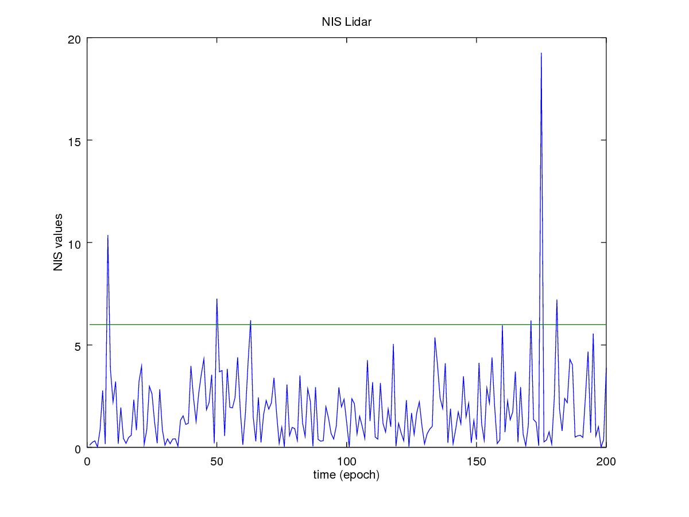

# **Unscented Kalman Filter Project Starter Code**
Self-Driving Car Engineer Nanodegree Program

## Kemal Tepe, ketepe@gmail.com

### Objective: Objective of this project to implement Unscented Kalman Filter (UKF) for sensor fusion application which combines lidar and radar sensor information.

### Summary: 

In this project utilize an Unscented Kalman Filter to estimate the state of a moving object of interest with noisy lidar and radar measurements. Original project description is provided by [README.md](./README.md). In this file, my explorations would be summarized.

### The goals / steps of this project are the following:

* Implement UKF for Radar and Lidar sensor data fusion.

* Explore parameter dependensies.

* Discuss results and future enhancements.

### 1. Implement UKF for Radar and Lidar sensor data fusion.

The implementation utilizes UKF lectures provided by Udacity. Once UKF lecture is completed, the rest is the integration of these modules (functions) in the ukf.cc and ukf.h files.

Prediction phase can be accomplished by following function.

```c++
void UKF::Prediction(double delta_t) {
  /**
  TODO:Complete this function! Estimate the object's location. Modify the state
  vector, x_. Predict sigma points, the state, and the state covariance matrix. */

  MatrixXd Xsig = MatrixXd(n_x_, 2 * n_x_ + 1);
  GenerateSigmaPoints(Xsig);

  MatrixXd Xsig_aug = MatrixXd(n_aug_, 2 * n_aug_ + 1);
  AugmentedSigmaPoints(Xsig, Xsig_aug);

  MatrixXd Xsig_pred = MatrixXd (n_x_, 2 * n_aug_ + 1);
  Xsig_pred.fill(0.0);
  SigmaPointPrediction(Xsig_aug, Xsig_pred, delta_t); 

	PredictMeanAndCovariance(Xsig_pred); 
	Xsig_pred_=Xsig_pred;
}
```

We need two update implementation one for Lidar, and one for Radar. Lidar would be acomplished by simply using Linear Kalman Filter (LKF) using the following code:

```c++

void UKF::UpdateLidar(MeasurementPackage meas_package) {
 
  VectorXd z=VectorXd(2);
  z(0)=meas_package.raw_measurements_[0];
  z(1)=meas_package.raw_measurements_[1];
  x_(3)=PhiNorm(x_(3));

	VectorXd z_pred = Hlidar_ * x_;
	
	VectorXd y = z - z_pred;
	
	MatrixXd Ht = Hlidar_.transpose();
	MatrixXd S = Hlidar_ * P_ * Ht + Rlidar_;
	MatrixXd Si = S.inverse();
	MatrixXd PHt = P_ * Ht;
	MatrixXd K = PHt * Si;

	//new estimate
	x_(3)=PhiNorm(x_(3));

	x_ = x_ + (K * y);
	
	x_(3)=PhiNorm(x_(3));

	int x_size = x_.size();
	MatrixXd I = MatrixXd::Identity(x_size, x_size);
	P_ = (I - K * Hlidar_) * P_;
	// INS calculation
	
  NISlidar_(NISlidar_counter_++)=y.transpose()*Si*y;
	
}

```

Update function  for radar needs to be implemented using UKF, and it is done by the following  function:

```c++

void UKF::UpdateState(VectorXd &z, VectorXd &z_pred, MatrixXd &S, MatrixXd &Zsig) {

  //set state dimension
  int n_x = 5;

  //set augmented dimension
  int n_aug = 7;

  //set measurement dimension, radar can measure r, phi, and r_dot
  int n_z = 3;

  //define spreading parameter
  double lambda = 3 - n_aug;

  //set vector for weights
  VectorXd weights = VectorXd(2*n_aug+1);
   double weight_0 = lambda/(lambda+n_aug);
  weights(0) = weight_0; 
  for (int i=1; i < 2 * n_aug+1; i++) {  
    //2n+1 weights
    double weight = 0.5/(n_aug+lambda);
    weights(i) = weight;
  }

  //create matrix for cross correlation Tc
  MatrixXd Tc = MatrixXd(n_x, n_z);

	//std part begin
  //calculate cross correlation matrix
  Tc.fill(0.0);
  for (int i = 0; i < 2 * n_aug + 1; i++) {  //2n+1 simga points

    //residual
    VectorXd z_diff = Zsig.col(i) - z_pred;
    //angle normalization
    //while (z_diff(1)<-M_PI) z_diff(1)+=2.*M_PI;
    z_diff(1)=PhiNorm(z_diff(1));	

    // state difference
    VectorXd x_diff = Xsig_pred_.col(i) - x_;
    //angle normalization    
  	x_diff(3)=PhiNorm(x_diff(3));	
    Tc = Tc + weights(i) * x_diff * z_diff.transpose();
  }

  //Kalman gain K;
  MatrixXd K = Tc * S.inverse();

  //residual
  VectorXd z_diff = z - z_pred;

  //angle normalization
  z_diff(1)=PhiNorm(z_diff(1));	
  //update state mean and covariance matrix
  x_(3)=PhiNorm(x_(3));
  x_ = x_ + K * z_diff;
  x_(3)=PhiNorm(x_(3));
  P_ = P_ - K*S*K.transpose();

  //VectorXd z_diff = z-z_pred;
  
  NISradar_(NISradar_counter_++)=z_diff.transpose() * S.inverse() * z_diff;

	return;
	
}
```
### 2. Explore parameter dependensies.

Performance of the UKF was measured using RMSE values of x and y positions as well as velocities in x and y directions. Another parameter which is important to observe is Normalized Innovation Squared (NIS) values.

 *NIS of Lidar, the values are consistenly below 5.9*


### 3. Results and Future Enhancements


